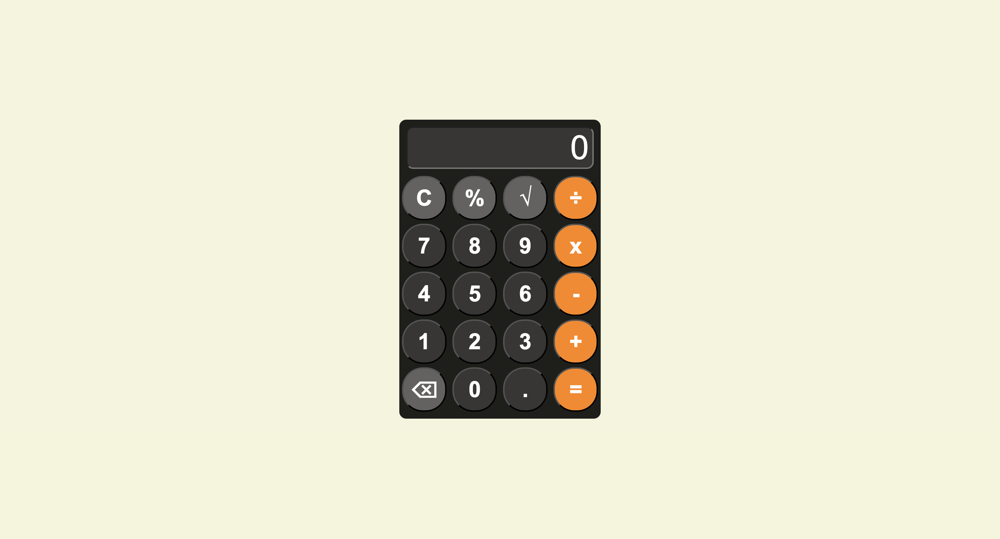
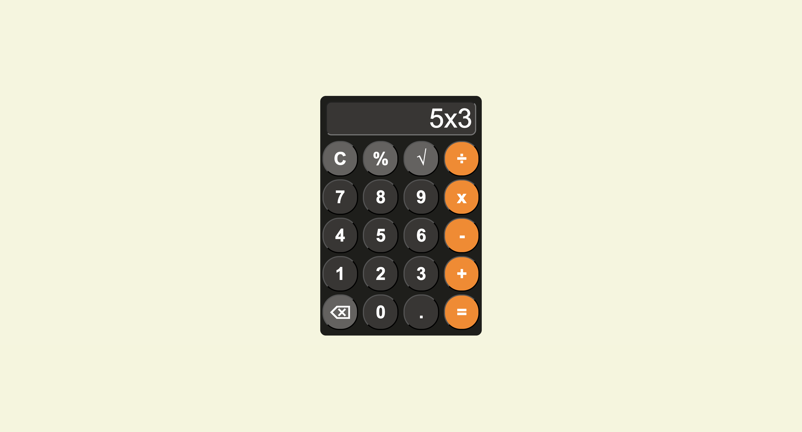

# JavaScript Calculator

A responsive web-based calculator built with **HTML, CSS, and JavaScript**.  
Supports basic arithmetic as well as additional features like **percentage, square root, decimals, and backspace**.

## Features
- Addition, subtraction, multiplication, division
- Percentage (%) and square root (√)
- Decimal numbers
- Backspace for corrections
- Error handling (prevents invalid inputs)
- Responsive layout with a clean UI

##  Screenshots
### Calculator Interface


### Example Calculation


##  How to Run
1. Clone this repository:
   ```bash
   git clone https://github.com/UrielHayble/javascript-calculator.git
2. Open index.html in any web browser.

echnologies Used

## Technologies used
- HTML5
- CSS3 (Flexbox/Grid for layout)
- Vanilla JavaScript
